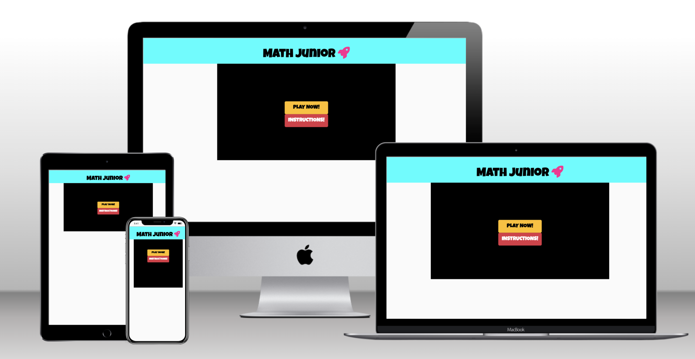
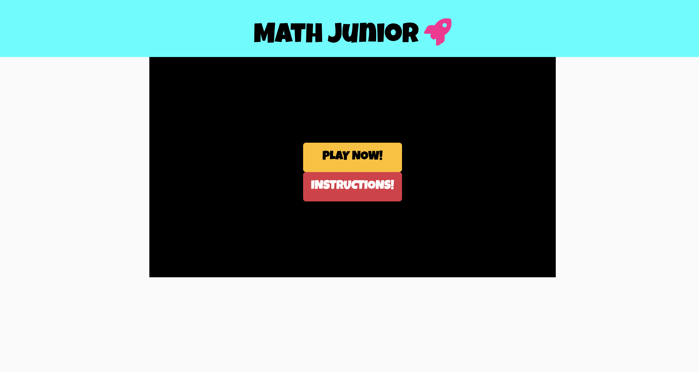
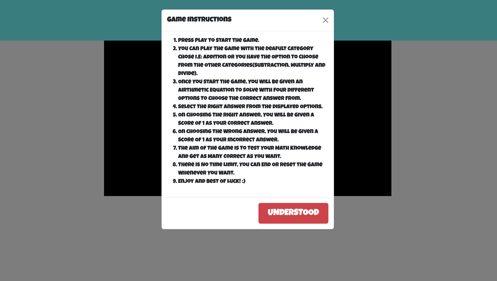
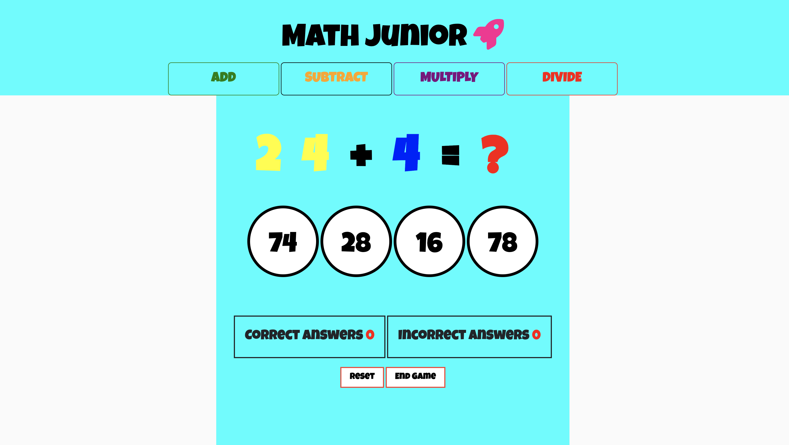
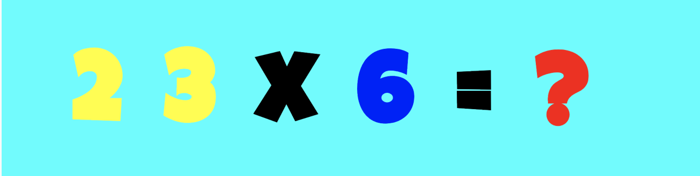
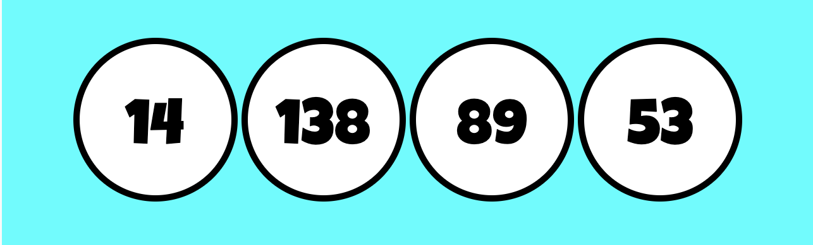
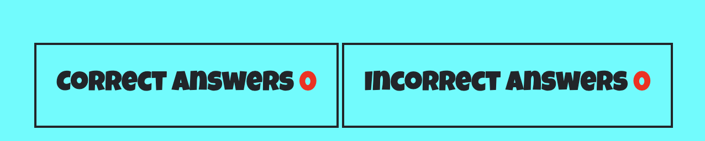
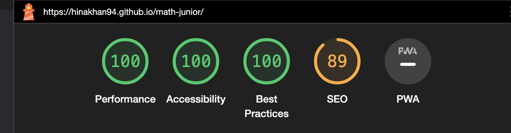
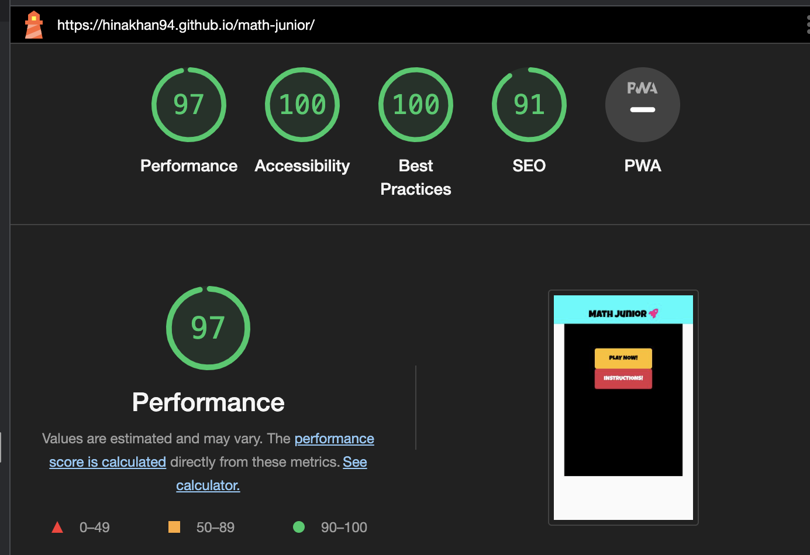

# Math Junior

The live preview can be viewed [here](https://hinakhan94.github.io/math-junior/) 

**Math Junior** is a quiz game made where the user can test his math knowledge. The quiz is targeted to kids who are learning basic mathematical expressions(addition, subtraction, multiplication and division). Math junior is a fully responsive JavaScript quiz game that will allow users to test their knowledge of math by selecting through 4 categories.

## Features
### *Existing Features*
**Landing page with Title, Start Button and Instructions Button**

Title is at the top middle of the page. When the page loads, the user is able to see the name of the quiz with two buttons (Start button and Instructions button).

### **The PlayGame Button**

This button allows the user to start the game. The section is hidden once the user clicks on the play button and the game area appears that allows the user to play with answering questions. 

### **The Instructions Button**

The instruction button when clicked opens up a modal which gives all the instructions related to the game play and it closes when the user clicks on the understood button or the cross at the top-right corner of the modal. It takes the user back to the landing page to start the game by clicking the play button.

### **The Game Page**

The game page has a header that features the title and 4 different categories. In this section the user can select the category that they find best and play the questions accordingly. By default, addition question is displayed but it can be changed as per user's wish. The game page also displays the following:

- Game area with question.
- Options to choose from. 
- Scoring area.  
- Buttons to end or reset the game.

### **Categories Section**

The categories section displays four basic airthmetic functions (addition, subtraction, multiplication and division) to the user to choose from. By default, the game sets the addition function first but the user can choose to start with any function as they wish by clicking on the desired category.

### **Equation Area**

The game question area will generate two random numbers for different categories indefinitely. There are no limit to questions so the user can play for as long as they want and each time the game will display a new question.

### **Options Area**

The game gives the users four different options to choose the right answer; out the four options one is a correct answer, there are no re tries. The user can only choose the answer once, if it is correct the score will be incremented accordingly otherwise incorrect with an alert error will be displayed and the user will be given a new question to solve.

### **Scoring Area**

The scoring is simple. If the user chosen option is correct, a score of 1 will be incremented and if the answer is incorrect, a score of 1 will be given to the incorrect scoring section. 

### **Reset Game**

The game can be rest at any point by simply clicking on the reset button and the correct and incorrect scores will be back to zero

### **End Game**

In order to end the game, the user can simply click on the end game button and a popup will show the users' final score and a button when clicked will take the user back to the landing page with a play button and instructions button.

## Game Design
### Main Color Palette

I have used solid colors to make my game attractive to kids. Main content colors are as follows:
- Aqua #02afd0 (for header and game container)
- Black #000000 (title) 
- White #fafafa (body)

I have many different contrasting colors for (options, categories, numbers, operators) to compliment the main color palette.

### Typography
Google Font is used as the main font of the game. For the icon, I have used font awesome.

- luckiest guy font is used with a fallback font of sans-serif.
- Icon: rocket(fa fa-)

### Skeleton 
The game is a simple one page structure.

The initial sketch was made using Balsamic Wireframes. It was discussed and motified with the guidance of my mentor.
You can view the draft [here](assets/readme.docs/pp2-wireframe.pdf)

## Technologies Used
### Languages Used
HTML, CSS and JavaScript.

### Frameworks, Libraries & Programs Used
- Balsamiq - Used to create wireframes.
- Github - To save and store the files. 
- Google Fonts - To import the fonts used in the game.
- Font Awesome - For the icon.
- Google Dev Tools - To troubleshoot and test features, solve issues with responsiveness and styling.

## Testing

Testing was continuous throughout construction. I used Chrome developer console during the construct to identify and fix any issues along the way.

The following issues were raised during the meeting with my mentor:

### Validator Testing
- HTML 
  * No errors were found when passing through the recommended [W3C Validator]()
- CSS
  * No errors were found when passing through the recommended [Jigsaw Validator](https://jigsaw.w3.org/css-validator/validator)

- JavaScript
  * No errors were found when passing through the official Jshint validator
    - The following metrics were returned:
       

## Accessibility

I have made sure that I have used complimentary color contrasts throughout the game and made sure to use semantic HTML for accessibility. 

### Lighthouse Testing
- Desktop View

- Mobile View 

### Browser Testing
- Chrome
- Safari
- Mozilla Firefox

## Unfixed Bugs
- Color of the answer options border appear differently when viewed on Safari browser. It is still in-progress phase.

## Deployment

- The site was deployed to Github pages, the process of deployment that I followed is as below:
  * In the Github repositiory section, went to the settings tab
  * From the source section drop-down menu, chose the Master Branch
  * Once the master branch was selected, the page automatically refreshed and displayed a successfull deployment

The link can be viewed [here]() 

## Credits

I would like to thanks my mentor Oluwafemi Medale for his constant support and guidance through out the completion of the project.

### Content
- The icon was taken from [Font Awesome](https://fontawesome.com/).
- The instructions to how to add modal to the instructions button was taken from [Bootstrap5](https://getbootstrap.com/) and [YouTube Channel](https:).
- The responsive mockup was generated with [Website Mockup Generator](https://techsini.com/multi-mockup/index.php)

